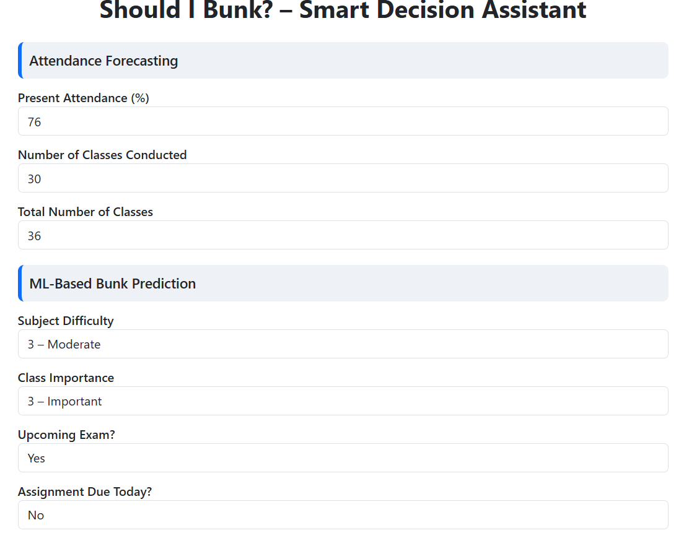
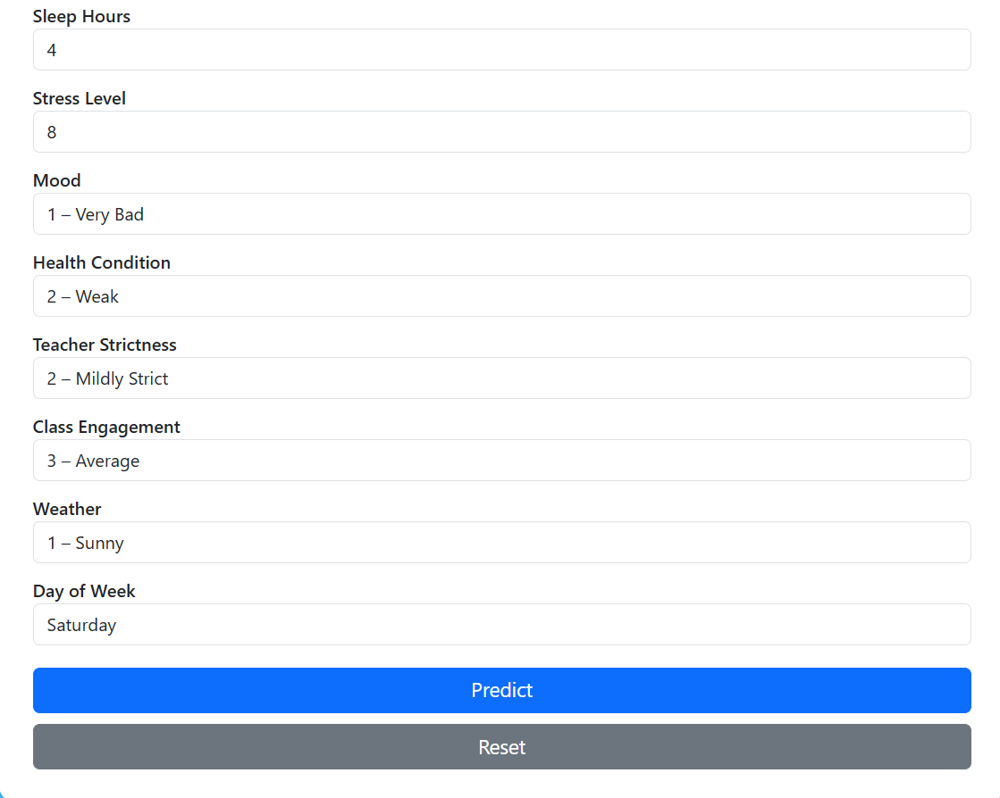
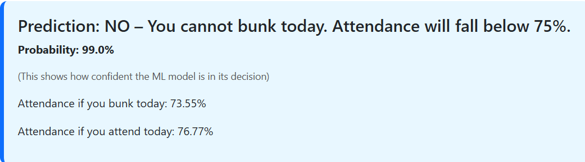

# Should I Bunk? – ML-Powered Class Attendance Decision App

A Machine Learning + Flask web application that predicts whether a student can safely bunk a class based on academic, behavioral, mood, and contextual factors.  
It also forecasts attendance percentage if the student **attends** or **bunks** today's class.

---

## 🚀 Features

### 🎯 **AI-Based Bunk Prediction**
Uses a trained **Random Forest Classifier** to evaluate:
- Subject difficulty  
- Class importance  
- Teacher strictness  
- Stress and sleep levels  
- Mood and health  
- Weather and day of week  
- Upcoming exams / assignments  

### 📊 **Attendance Forecasting**
The app calculates:
- **Attendance if you attend today**
- **Attendance if you bunk today**
- Helps ensure attendance stays above **75%**

### 💡 **Model Confidence Probability**
Shows how confident the ML model is in its prediction.

### 🌐 **Interactive Web UI**
- Built using **Flask** + **Bootstrap**
- Clean and user-friendly
- Inputs remain after prediction
- **Reset button** clears all inputs

---

## 📁 Project Structure
should-i-bunk/
│
├── app.py # Flask backend (main application)
├── should_i_bunk_model.pkl # Trained Random Forest ML model
├── should_i_bunk_dataset.csv # Synthetic training dataset
├── ShouldIBunk.ipynb # Jupyter notebook (data creation + training)
├── requirements.txt # Python dependencies
├── README.md # Project documentation
│
└── templates/
└── index.html # Frontend user interface (Jinja2 template)


---

## ⚙️ Installation & Usage

### Clone this repository
```bash
git clone https://github.com/YOUR_USERNAME/should-i-bunk.git
cd should-i-bunk
```
---

## Install Dependencies
```bash
pip install -r requirements.txt
```
---
## Run the Flask App
```bash
python app.py
```
---
## Open in browser
```bash
http://127.0.0.1:5000/
```

## 🧠 Machine Learning Model

### 🔍 Algorithm Used
**Random Forest Classifier**

### 📌 Why Random Forest?
- Handles mixed numerical + categorical features  
- Robust to noise  
- High accuracy  
- Low overfitting compared to single decision trees  
- Works well on small and synthetic datasets  

### 🏗️ Training Details
- ~1000-row synthetic dataset  
- 12 behavioral + academic features  
- Encoded categorical values  
- Train/test split  
- Accuracy optimized through parameter tuning  

The full training process is documented in:  
**ShouldIBunk.ipynb**

---

## 🧮 Attendance Forecasting Formula

### **If Student Attends Today:**
```bash
attendance = (attended_classes + 1) / (total_classes + 1) * 100
```

### **If Student Bunks Today:**
```bash
attendance = attended_classes / (total_classes + 1) * 100
```


This matches the official academic attendance formula used in colleges.

---

## 🖥️ Tech Stack

### **Backend**
- Python  
- Flask  
- Scikit-learn  
- Pandas  
- NumPy  
- Joblib  

### **Frontend**
- HTML  
- CSS  
- Bootstrap  
- Jinja2 Templates  

---

## 📚 Dataset

This project uses a **synthetic dataset** to avoid privacy issues.

The dataset includes the following features:
- Stress level  
- Sleep hours  
- Mood  
- Health  
- Teacher strictness  
- Subject difficulty  
- Attendance percentage  
- Weather  
- Day of week  
- Assignment due  
- Upcoming exam  
- Class importance  
- Class engagement  

---

## 📷 Screenshots





